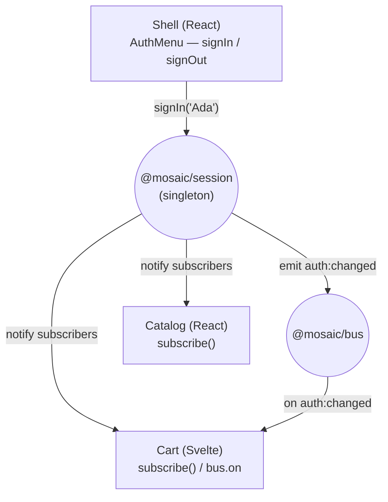

## What we're building

Sign in once, in the shell, and watch every remote update: the React catalog greets you by name, the Svelte cart shows who's signed in, the shell's menu flips to "Sign out". All from the one [`@mosaic/session`](/mosaic/en/auth-state/session-singleton/) instance, with each remote choosing how it hears about changes.



Two ways to react, and we'll use both so you can see the tradeoff:

- **`subscribe()`** — import the session package and get the whole `Session` object on every change. Best when a remote already depends on `@mosaic/session`.
- **`bus.on('auth:changed')`** — hear about changes without importing the session at all. Best for code that shouldn't depend on the session package (a plain custom element, the Astro island).

## Why

The [previous lesson](/mosaic/en/auth-state/session-singleton/) built one shared session. This lesson is about **reacting** to it correctly across frameworks. The failure mode to avoid: a remote reads `getSession()` once at mount and never updates, so you sign in and the catalog still greets you as "guest" until a reload. Shared state is only useful if consumers *subscribe* to changes, not just read once.

Because the session is a singleton, a remote can import it directly and call `subscribe()` — the callback fires from the same store the shell writes to. That's the simplest path and it's fully typed (you get a `Session`, not an untyped event payload). But it *couples* that remote to `@mosaic/session`. Some consumers shouldn't take that dependency — a design-system web component, or the Astro content that isn't a Module Federation remote at all. For them, `auth:changed` on the bus carries the same news with no import. Choosing between the two is the real lesson: **import-and-subscribe when you already depend on the session; listen on the bus when you'd rather not.**

## Pros & cons

**`subscribe()` (import the singleton) vs. `bus.on('auth:changed')` (no import)**

- **Pros of `subscribe()`:** Fully typed `Session` object, the complete current state on every change, and a synchronous `getSession()` for the initial read. No event-name indirection.
- **Cons of `subscribe()`:** Couples the consumer to `@mosaic/session` — it must share the singleton and track its version. `bus.on` avoids the dependency entirely (ideal for the Astro island or a framework-agnostic element), at the cost of a thinner payload and looser typing.

**Reacting to changes vs. reading `getSession()` once at mount**

- **Pros of reacting:** The UI stays correct after any sign-in or sign-out, from anywhere, with no reload. One source of truth, live.
- **Cons of reacting:** Every consumer needs a subscription and its cleanup (an effect, an `onMount` teardown). A missed unsubscribe leaks listeners; forgetting to react at all leaves stale UI that looks fine until someone signs in.

## Set it up

### 1. `apps/shell/src/AuthMenu.tsx`

The shell is where you sign in and out. It reads the session and reacts, like any consumer.

```tsx
import { useEffect, useState } from 'react';
import { getSession, signIn, signOut, subscribe, type Session } from '@mosaic/session';

export function AuthMenu() {
  const [session, setSession] = useState<Session>(getSession());
  useEffect(() => subscribe(setSession), []);

  return session ? (
    <button onClick={() => signOut()}>Sign out ({session.name})</button>
  ) : (
    <button onClick={() => signIn('Ada')}>Sign in</button>
  );
}
```

### 2. `apps/catalog/src/Greeting.tsx` — React remote, via `subscribe()`

The catalog already lives in the shared module graph, so it imports the session and subscribes. `useEffect` returns `subscribe`'s unsubscribe as cleanup.

```tsx
import { useEffect, useState } from 'react';
import { getSession, subscribe, type Session } from '@mosaic/session';

export function Greeting() {
  const [session, setSession] = useState<Session>(getSession());
  useEffect(() => subscribe(setSession), []);

  return <p>{session ? `Hi, ${session.name}` : 'Browsing as a guest'}</p>;
}
```

### 3. `apps/cart/src/CartApp.svelte` — Svelte remote, via `subscribe()`

The Svelte cart reads the same singleton. `$state` holds the session; `onMount` wires `subscribe` and returns its teardown.

```svelte
<script lang="ts">
  import { getSession, subscribe, type Session } from '@mosaic/session';
  import { onMount } from 'svelte';

  let session = $state<Session>(getSession());
  onMount(() => subscribe((s) => (session = s)));
</script>

{#if session}
  <p class="cart-owner">Cart for {session.name}</p>
{:else}
  <p class="cart-owner">Sign in to save your cart</p>
{/if}
```

### 4. The bus path, for consumers that shouldn't import the session

A design-system element or the Astro content island can react without depending on `@mosaic/session` — it only needs the bus:

```ts
import { bus } from '@mosaic/bus';

// No import of @mosaic/session. Same news, thinner payload.
bus.on('auth:changed', ({ name }) => {
  document.querySelector('.who')!.textContent = name ? `Hi, ${name}` : 'Guest';
});
```

Use this for anything outside the Module Federation share scope; use `subscribe()` everywhere that already depends on the session.

## Verify

Run the shell and both remotes:

```bash
pnpm --filter shell dev
pnpm --filter catalog dev
pnpm --filter cart dev
```

At `http://localhost:5000`:

1. Signed out: the catalog reads **"Browsing as a guest"**, the cart reads **"Sign in to save your cart"**, the menu shows **Sign in**.
2. Click **Sign in** in the shell's `AuthMenu`.
3. Without reloading: the catalog flips to **"Hi, Ada"**, the cart to **"Cart for Ada"**, the menu to **"Sign out (Ada)"** — all three react to the one change.
4. Click **Sign out** — every surface returns to its signed-out text.
5. Sign in again, then **reload** — the session persists (from `localStorage`) and every remote comes back showing Ada, because each reads `getSession()` on mount.

To see the bus path, add the step-4 snippet to a `.who` element and confirm it updates on `auth:changed` without importing the session.

Then build the workspace:

```bash
pnpm -r build
```

Expected: all apps build; at runtime the shell console shows no singleton-version mismatch for `@mosaic/session`.

**Check your understanding:**

1. When should a remote react via `subscribe()` versus `bus.on('auth:changed')`? Give a concrete consumer for each.
2. A remote calls `getSession()` at mount but never subscribes. What does the user see after signing in from the shell, and why?
3. The catalog (React) and the cart (Svelte) both show the new name with no reload. What single fact about `@mosaic/session` makes that work across two frameworks?
4. Why does the bus path carry `{ userId, name }` instead of the full `Session` — and what does a consumer give up by using it?

## Recap

You made one session visible everywhere: the shell signs in and out, the React catalog and Svelte cart react via `subscribe()`, and framework-agnostic code reacts via `auth:changed` on the bus — no reloads, no drift, one singleton behind it all. You've now covered the two decoupled channels between MFEs: the event bus for facts, the shared singleton for state. Next, give all three frameworks one consistent look: [Shared Design System →](/mosaic/en/design-system/).
