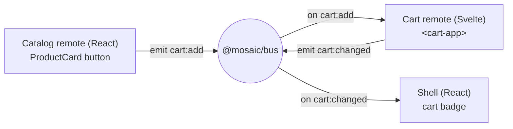

## What we're building

The payoff of the event bus: a real "add to cart" flow that crosses three independently-deployed micro-frontends in three different setups, with **no remote importing another**.



The [React catalog](/mosaic/en/catalog/the-catalog-remote/) emits `cart:add` when you click "Add to cart". The [Svelte cart](/mosaic/en/cart/mount-via-web-component/) hears it, updates its own state, and emits `cart:changed`. The shell hears `cart:changed` and updates the badge in the top-nav. Three hops, one bus, zero cross-remote imports.

## Why

This is the moment the architecture earns its complexity. A single SPA would just call a `useCart()` hook or read a shared store — one framework, one module graph, trivial. Mosaic can't: the emitter is React, the receiver is Svelte, and they ship separately. The only thing all three share is [`@mosaic/bus`](/mosaic/en/communication/the-event-bus/), and the bus knows about none of them.

Notice the shape of the data flow. The catalog **doesn't** update the cart directly and it **doesn't** update the badge — it announces a fact ("this product was added") and stops. The cart owns cart state, so it's the one that recomputes totals and announces the new state (`cart:changed`). The shell owns the badge, so it's the one that listens for `cart:changed`. Each MFE owns its own slice of state and only *broadcasts* changes. That discipline — own your state, emit facts, react to others' facts — is what keeps the seams decoupled as the app grows.

## Pros & cons

**Bus events vs. a shared cart store imported by every remote**

- **Pros:** No remote depends on another's code, so each still deploys alone. The cart is free to store its state however it likes (a Svelte rune here) without exposing that choice to the catalog or shell. Adding a fourth listener (analytics, a toast) touches nothing that already exists.
- **Cons:** The flow is indirect — to follow "click → badge" you read three files linked only by event names, not by call sites. There's no single place that describes the whole cart; state lives in the cart remote and is mirrored, not shared.

**One-way facts (`cart:add` then a separate `cart:changed`) vs. a request that returns a result**

- **Pros:** The emitter never blocks or waits, and the receiver is free to ignore, batch, or debounce. The cart stays the single owner of cart truth; everyone else reacts to what it announces.
- **Cons:** The catalog gets no direct confirmation that the add succeeded — if it wants feedback (e.g. a "1 in cart" count), it has to *also* listen for `cart:changed`. Two events model one interaction, which you have to keep in your head.

## Set it up

### 1. `apps/catalog/src/ProductCard.tsx`

The React catalog emits `cart:add`. It imports the bus — never the cart.

```tsx
import { bus } from '@mosaic/bus';

type Product = { id: string; name: string; priceCents: number };

export function ProductCard({ product }: { product: Product }) {
  return (
    <article className="product-card">
      <h3>{product.name}</h3>
      <m-price cents={String(product.priceCents)}></m-price>
      <button
        onClick={() =>
          bus.emit('cart:add', {
            productId: product.id,
            name: product.name,
            priceCents: product.priceCents,
          })
        }
      >
        Add to cart
      </button>
    </article>
  );
}
```

### 2. `apps/cart/src/CartApp.svelte`

The Svelte cart owns cart state. It listens for `cart:add`, updates its list, and emits `cart:changed` with the new totals. Svelte 5 runes (`$state`) give deep reactivity, so pushing to the array updates the UI. `onMount` returns the bus's unsubscribe for cleanup.

```svelte
<script lang="ts">
  import { bus } from '@mosaic/bus';
  import { onMount } from 'svelte';

  type Line = { productId: string; name: string; priceCents: number; qty: number };

  let lines = $state<Line[]>([]);

  const count = $derived(lines.reduce((n, l) => n + l.qty, 0));
  const totalCents = $derived(lines.reduce((n, l) => n + l.priceCents * l.qty, 0));

  onMount(() =>
    bus.on('cart:add', (p) => {
      const existing = lines.find((l) => l.productId === p.productId);
      if (existing) existing.qty += 1;
      else lines.push({ ...p, qty: 1 });

      // Announce the new cart state. The shell (and anyone else) reacts to this.
      bus.emit('cart:changed', { count, totalCents });
    }),
  );
</script>

<ul class="cart">
  {#each lines as line (line.productId)}
    <li>{line.name} × {line.qty}</li>
  {/each}
</ul>
<p>{count} items · <m-price cents={String(totalCents)}></m-price></p>
```

### 3. `apps/shell/src/CartBadge.tsx`

The shell owns the top-nav badge. It listens for `cart:changed` and renders the count. `useEffect` returns `bus.on(...)`'s unsubscribe directly as its cleanup.

```tsx
import { useEffect, useState } from 'react';
import { bus } from '@mosaic/bus';

export function CartBadge() {
  const [count, setCount] = useState(0);

  useEffect(() => bus.on('cart:changed', (p) => setCount(p.count)), []);

  return (
    <span className="cart-badge" aria-label={`${count} items in cart`}>
      {count}
    </span>
  );
}
```

Three files, three frameworks, and the only shared import in any of them is `@mosaic/bus`.

## Verify

Run the shell and both remotes together (each shares the bus singleton from the [previous lesson](/mosaic/en/communication/the-event-bus/)):

```bash
pnpm --filter shell dev
pnpm --filter catalog dev
pnpm --filter cart dev
```

Open the shell at `http://localhost:5000` and:

1. Note the cart badge reads **0**.
2. Click **Add to cart** on a product in the catalog.
3. The Svelte cart list gains the item, and the shell badge ticks to **1**.
4. Click the same product again — the line shows **× 2** and the badge reads **2**.

To prove the decoupling, open DevTools **Network**, throttle, and confirm no request or import goes *between* remotes — the only cross-MFE traffic is each loading its own `remoteEntry.js`. The click-to-badge path is pure in-page events.

Then confirm the workspace builds:

```bash
pnpm -r build
```

Expected: all apps build; no remote's build references another remote's source.

**Check your understanding:**

1. Why does the cart — not the catalog — emit `cart:changed`? What principle decides who emits which event?
2. The catalog click never touches the badge, yet the badge updates. Trace the two hops and name the event on each.
3. If you wanted the catalog button to show "1 in cart" after adding, which event would it subscribe to, and why can't it just read the cart's state?
4. What in this wiring still lets the cart team change how the cart stores its lines without breaking the catalog or shell?

## Recap

You wired a full cross-framework "add to cart": the React catalog emits `cart:add`, the Svelte cart updates and emits `cart:changed`, and the shell's badge reacts — no remote importing another, only `@mosaic/bus` between them. Each MFE owns its state and broadcasts facts. Next, apply the same decoupling to identity: [Shared Auth & State →](/mosaic/en/auth-state/) gives every remote one session without tight coupling.
