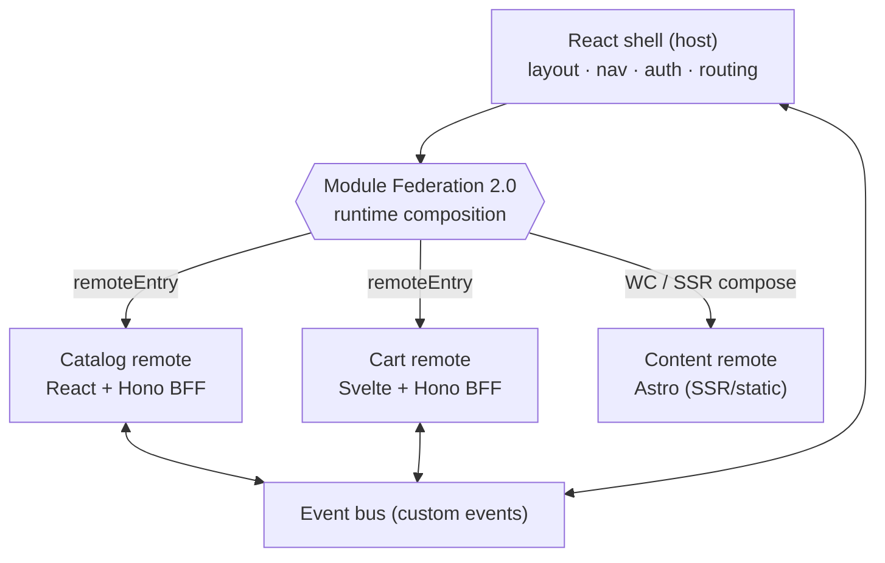

## The shape of the system

Mosaic is **one shell composing several independently-deployed remotes at runtime**.

The **shell** is a React app that owns everything shared: the layout, the top-nav, the session, and the top-level routes. It does **not** import the remotes at build time — it loads them at **runtime** from their `remoteEntry` URLs. So the catalog team can deploy a new catalog and the shell picks it up on the next load, with no rebuild of the shell or the other remotes. That single property — **independent deployment** — is what everything else in this architecture exists to make safe.

## Why this shape

A traditional single-page app is one build, one deploy, one team's release train. Micro-frontends break that apart the same way microservices broke apart the monolithic backend:

- **Independent deploys.** Each remote builds and ships on its own schedule. Shipping the cart doesn't rebuild the catalog.
- **Independent tech.** The catalog is React, the cart is Svelte, the content is Astro — each team picks what fits, and the shell doesn't care.
- **Vertical ownership.** Each remote owns its **UI and its data** (a thin Hono BFF), so a slice is a full feature a team can own end to end.

The cost is real and worth naming up front: composing independent apps at runtime brings problems a single SPA never has — shared dependencies must be deduplicated, remotes can fail to load, styles and routing must be coordinated across teams, and communication has to stay decoupled. Most of Mosaic's modules exist to solve exactly those.

## The pieces

- **Shell (host)** — React + Vite + **Module Federation 2.0**. Loads remotes at runtime, owns layout/nav/auth/routing.
- **Catalog remote** — React + a thin **Hono** BFF, exposed as a federated module.
- **Cart remote** — Svelte + Hono BFF, mounted in the React shell through a **Web Component** wrapper.
- **Content remote** — **Astro** (SSR/static). Astro doesn't runtime-federate like a SPA, so it's integrated via the Web-Component / SSR-composition path — a deliberate lesson in the limits of Module Federation.
- **Web Components** — the universal mounting boundary and a shared **design system** every framework consumes.
- **Event bus** — decoupled custom events, so remotes react to "add to cart" without importing each other.

## Verify

You're ready to move on when you can answer these in your own words:

- Trace what happens when the catalog team deploys a new version. What rebuilds, and what doesn't — and which architectural choice makes that true?
- Why does the shell load remotes at *runtime* from `remoteEntry` instead of importing them at build time?
- Astro can't be a Module Federation remote the way React and Svelte can. Why — and how does Mosaic integrate it anyway?
- Name two problems runtime composition introduces that a single SPA never has.

Next, the [prerequisites](/mosaic/en/introduction/prerequisites/) get your machine ready.
