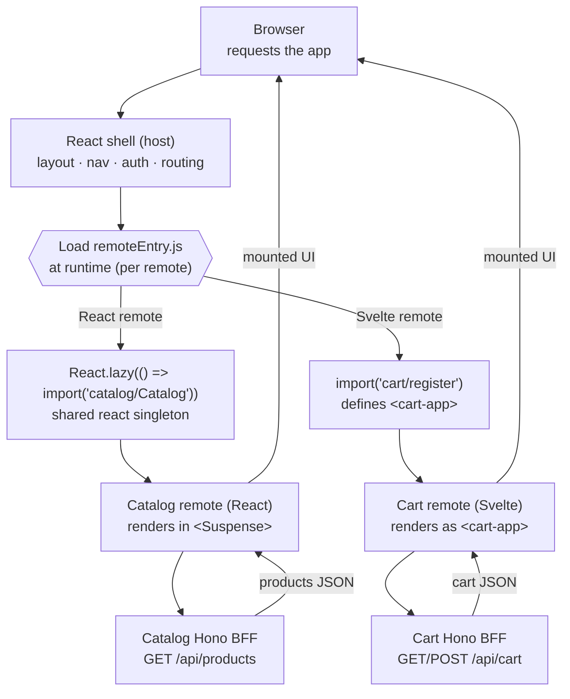

You started with an empty monorepo and finished with a storefront that several independent teams could own, each in its own framework, each deployable on its own. This page pulls the whole system back into one view — what you built, how a request actually flows through it, and the decisions you can now argue for out loud.

## What you built

Mosaic is a **React shell composing React and Svelte remotes at runtime via Module Federation 2.0**, with Astro content integrated through the Web-Component path and a thin Hono BFF behind every slice. You built it in layers:

- The **monorepo and BFF stack** — pnpm workspaces, Vite, `@module-federation/vite`, and the tiny Hono pattern every remote reuses. See [Setup & Tooling →](/mosaic/en/setup/).
- The **shell (host)** — the React app that owns layout, top-nav, routing, and the Module Federation host config. See [The Shell (Host) →](/mosaic/en/shell/).
- **Module Federation core** — exposing and consuming a remote at runtime from `remoteEntry.js`, and sharing React as a singleton. See [Module Federation Core →](/mosaic/en/federation/).
- The **catalog remote** — your first federated React remote and its Hono BFF, a full vertical slice. See [Catalog Remote (React) →](/mosaic/en/catalog/).
- **Web Components interop** — wrapping a remote as a custom element so the host mounts it framework-agnostically, plus a first design-system primitive. See [Web Components Interop →](/mosaic/en/web-components/).
- The **cart remote (Svelte)** — a Svelte 5 remote and its BFF, mounted in the React shell as a `<cart-app>` custom element. See [Cart Remote (Svelte) →](/mosaic/en/cart/).
- The **content remote (Astro)** — SSR/static marketing pages integrated via the WC/SSR path rather than Module Federation. See [Content Remote (Astro) →](/mosaic/en/content/).
- **Cross-MFE communication** — the typed event bus that lets catalog say "add to cart" without importing the cart. See [Cross-MFE Communication →](/mosaic/en/communication/).
- **Shared auth & state** — a session singleton every MFE sees exactly once. See [Shared Auth & State →](/mosaic/en/auth-state/).
- The **shared design system** — tokens and Web-Component primitives consumed identically by React, Svelte, and Astro. See [Shared Design System →](/mosaic/en/design-system/).
- **Routing across MFEs** — the shell owning top-level routes, remotes owning their sub-routes, deep links resolving into the right remote. See [Routing Across MFEs →](/mosaic/en/routing/).
- **Resilience & performance** — fallbacks when a remote fails to load, lazy loading, and shared-dependency dedupe. See [Resilience & Performance →](/mosaic/en/resilience/).
- **Independent deployment** — shipping one slice's UI and BFF without rebuilding the shell or the other remotes. See [Independent Deployment →](/mosaic/en/deployment/).

## The path of a runtime remote

Nothing about Mosaic happens at build time that a single SPA couldn't do. The whole point lives at **runtime** — when the browser loads the shell and the shell reaches out for remotes it never imported. Here is the full round trip, from a page load to the pixels and back:

Read it as one sentence: the browser loads the **shell**, the shell fetches each remote's **`remoteEntry.js`** at runtime, a **React** remote mounts through `React.lazy` sharing the host's React while a **Svelte** remote mounts as a **`<cart-app>` custom element** sharing nothing React, each remote talks to **its own Hono BFF**, and the rendered UI lands back in the page. Two frameworks, two deploy trains, one composed experience — and the shell imported neither at build time.

## The decisions you can now defend

Every one of these was a fork in the road with a real alternative. You can now say why Mosaic went the way it did — and what it cost.

| Decision | Why | Trade-off | Lesson |
|---|---|---|---|
| Module Federation **runtime** composition, not build-time bundling | Each remote deploys on its own; the shell picks up a new `remoteEntry.js` on the next load with no rebuild | Runtime loading adds a network hop, needs dependency dedupe, and can fail — problems a single bundle never has | [Module Federation Core →](/mosaic/en/federation/expose-and-consume/) |
| Multi-framework via **Web Components** | A custom-element boundary lets a Svelte (or Astro) remote mount inside a React shell that shares no framework code with it | You give up React-native props/context across the boundary and pass data as attributes/events instead | [Web Components Interop →](/mosaic/en/web-components/custom-element-boundary/) |
| A **per-remote Hono BFF** (vertical slices) | Each team owns its UI *and* its data end to end, so a slice is a full feature with no shared-backend coupling | More services to run and deploy; shared concerns can drift across BFFs if you're not deliberate | [Catalog BFF →](/mosaic/en/catalog/catalog-bff/) |
| An **event bus**, not shared imports | Remotes react to "add to cart" without importing each other, keeping them independently deployable | Events are untyped contracts at the wire; a renamed event breaks silently unless you version it | [The Event Bus →](/mosaic/en/communication/the-event-bus/) |
| **Independent deployment** of each slice | Ship one team without redeploying the others — the payoff the whole architecture exists to protect | You must version remotes and keep the shell tolerant of a remote being briefly unavailable | [Versioning Remotes →](/mosaic/en/deployment/versioning-remotes/) |

If you can walk someone through this table without the notes, you understand micro-frontends — not as a buzzword, but as a set of trades you chose on purpose.

## What was deliberately simplified

Mosaic is a teaching build. Several things are honest stand-ins for production concerns, so the composition stays the star:

- **Mock auth.** The session is a localStorage singleton, not real authentication — enough to prove one session flows through every MFE, no more. See [Shared Auth & State →](/mosaic/en/auth-state/session-singleton/).
- **In-memory BFFs.** Each Hono BFF serves fixed JSON from memory; there is no database, no persistence across restarts. The BFF *shape* is real; the storage is not. See [Catalog BFF →](/mosaic/en/catalog/catalog-bff/).
- **Astro integrated via Web Components, not Module Federation.** Astro doesn't runtime-federate like a SPA, so the content remote joins through the WC/SSR path — a deliberate lesson that not everything fits Module Federation. See [Composing SSR →](/mosaic/en/content/composing-ssr/).
- **No SSR streaming.** The shell composes remotes on the client; there's no server-side streaming of remote HTML into the initial response. That's the first thing you'd add for real, and the [next steps](/mosaic/en/wrap-up/next-steps/) start there.

None of these change the architecture — they're the parts you'd harden after the shape is proven.

## Recap

You built a runtime-composed, multi-framework storefront and, more importantly, you can now defend every seam in it: why the shell loads remotes at runtime, why Web Components are the cross-framework boundary, why each slice owns its own BFF, why remotes talk over a bus instead of importing each other, and why independent deployment is the whole point.

Next, take Mosaic past the teaching build: [Next Steps →](/mosaic/en/wrap-up/next-steps/).
