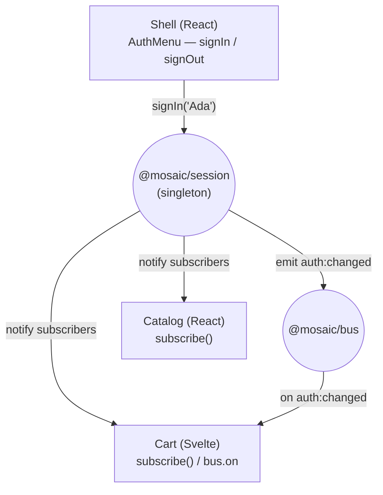

## สิ่งที่จะสร้าง

sign in ครั้งเดียวที่ shell แล้วดูทุก remote อัปเดต: React catalog ทักคุณด้วยชื่อ, Svelte cart แสดงว่าใคร sign in อยู่, menu ของ shell พลิกเป็น "Sign out" ทั้งหมดมาจาก instance เดียวของ [`@mosaic/session`](/mosaic/th/auth-state/session-singleton/) โดยแต่ละ remote เลือกเองว่าจะรับรู้การเปลี่ยนแปลงอย่างไร



สองวิธีในการ react และเราจะใช้ทั้งคู่เพื่อให้คุณเห็น tradeoff:

- **`subscribe()`** — import package session แล้วรับ object `Session` เต็ม ๆ ทุกการเปลี่ยนแปลง ดีที่สุดเมื่อ remote พึ่ง `@mosaic/session` อยู่แล้ว
- **`bus.on('auth:changed')`** — รับรู้การเปลี่ยนแปลงโดยไม่ import session เลย ดีที่สุดสำหรับโค้ดที่ไม่ควรพึ่ง package session (custom element ธรรมดา, Astro island)

## ทำไม

[บทที่แล้ว](/mosaic/th/auth-state/session-singleton/) สร้าง session เดียวที่ใช้ร่วมกัน บทนี้ว่าด้วยการ **react** ต่อ session นั้นให้ถูกต้องข้าม framework failure mode ที่ต้องเลี่ยง: remote อ่าน `getSession()` ครั้งเดียวตอน mount แล้วไม่อัปเดตอีก คุณ sign in แล้ว catalog ยังทักคุณว่า "guest" จนกว่าจะ reload shared state มีประโยชน์ก็ต่อเมื่อ consumer *subscribe* การเปลี่ยนแปลง ไม่ใช่แค่อ่านครั้งเดียว

เพราะ session เป็น singleton remote จึง import ตรง ๆ แล้วเรียก `subscribe()` ได้ — callback fire จาก store ตัวเดียวกับที่ shell เขียน นั่นคือเส้นทางที่ง่ายที่สุดและ typed เต็ม (คุณได้ `Session` ไม่ใช่ event payload ที่ไม่มี type) แต่วิธีนี้ *couple* remote นั้นกับ `@mosaic/session` consumer บางตัวไม่ควรรับ dependency นั้น — design-system web component หรือ Astro content ที่ไม่ได้เป็น Module Federation remote เลย สำหรับพวกนั้น `auth:changed` บน bus พาข่าวเดียวกันมาโดยไม่ต้อง import การเลือกระหว่างสองทางนี้คือบทเรียนตัวจริง: **import-and-subscribe เมื่อคุณพึ่ง session อยู่แล้ว; ฟังบน bus เมื่อคุณไม่อยากพึ่ง**

## ข้อดีข้อเสีย

**`subscribe()` (import the singleton) vs. `bus.on('auth:changed')` (no import)**

- **Pros of `subscribe()`:** object `Session` ที่ typed เต็ม, state ปัจจุบันครบทุกการเปลี่ยนแปลง และ `getSession()` แบบ synchronous สำหรับการอ่านครั้งแรก ไม่มีการอ้อมผ่านชื่อ event
- **Cons of `subscribe()`:** couple consumer กับ `@mosaic/session` — consumer ต้อง share singleton และตาม version `bus.on` เลี่ยง dependency ทั้งหมด (เหมาะกับ Astro island หรือ element ที่ไม่ผูก framework) แลกกับ payload ที่บางกว่าและ typing ที่หลวมกว่า

**Reacting to changes vs. reading `getSession()` once at mount**

- **Pros of reacting:** UI ถูกต้องเสมอหลัง sign in หรือ sign out จากที่ไหนก็ได้ โดยไม่ต้อง reload source of truth เดียว แบบ live
- **Cons of reacting:** ทุก consumer ต้องมี subscription และการ cleanup ของตัวเอง (effect, `onMount` teardown) การพลาด unsubscribe ทำให้ listener รั่ว; การลืม react ไปเลยทำให้ UI ค้างที่ดูปกติจนกว่าจะมีใคร sign in

## ติดตั้ง

### 1. `apps/shell/src/AuthMenu.tsx`

shell คือที่ที่คุณ sign in และ out shell อ่าน session แล้ว react เหมือน consumer ตัวอื่น ๆ

```tsx
import { useEffect, useState } from 'react';
import { getSession, signIn, signOut, subscribe, type Session } from '@mosaic/session';

export function AuthMenu() {
  const [session, setSession] = useState<Session>(getSession());
  useEffect(() => subscribe(setSession), []);

  return session ? (
    <button onClick={() => signOut()}>Sign out ({session.name})</button>
  ) : (
    <button onClick={() => signIn('Ada')}>Sign in</button>
  );
}
```

### 2. `apps/catalog/src/Greeting.tsx` — React remote, via `subscribe()`

catalog อยู่ใน shared module graph อยู่แล้ว จึง import session แล้ว subscribe ได้เลย `useEffect` return unsubscribe ของ `subscribe` เป็น cleanup

```tsx
import { useEffect, useState } from 'react';
import { getSession, subscribe, type Session } from '@mosaic/session';

export function Greeting() {
  const [session, setSession] = useState<Session>(getSession());
  useEffect(() => subscribe(setSession), []);

  return <p>{session ? `Hi, ${session.name}` : 'Browsing as a guest'}</p>;
}
```

### 3. `apps/cart/src/CartApp.svelte` — Svelte remote, via `subscribe()`

Svelte cart อ่าน singleton ตัวเดียวกัน `$state` เก็บ session; `onMount` ต่อ `subscribe` แล้ว return teardown กลับไป

```svelte
<script lang="ts">
  import { getSession, subscribe, type Session } from '@mosaic/session';
  import { onMount } from 'svelte';

  let session = $state<Session>(getSession());
  onMount(() => subscribe((s) => (session = s)));
</script>

{#if session}
  <p class="cart-owner">Cart for {session.name}</p>
{:else}
  <p class="cart-owner">Sign in to save your cart</p>
{/if}
```

### 4. The bus path, for consumers that shouldn't import the session

design-system element หรือ Astro content island react ได้โดยไม่ต้องพึ่ง `@mosaic/session` — ต้องการแค่ bus:

```ts
import { bus } from '@mosaic/bus';

// No import of @mosaic/session. Same news, thinner payload.
bus.on('auth:changed', ({ name }) => {
  document.querySelector('.who')!.textContent = name ? `Hi, ${name}` : 'Guest';
});
```

ใช้แบบนี้กับอะไรก็ตามที่อยู่นอก Module Federation share scope; ใช้ `subscribe()` ทุกที่ที่พึ่ง session อยู่แล้ว

## ตรวจสอบผล

รัน shell และ remote ทั้งสอง:

```bash
pnpm --filter shell dev
pnpm --filter catalog dev
pnpm --filter cart dev
```

ที่ `http://localhost:5000`:

1. ตอน sign out: catalog อ่าน **"Browsing as a guest"**, cart อ่าน **"Sign in to save your cart"**, menu แสดง **Sign in**
2. คลิก **Sign in** ใน `AuthMenu` ของ shell
3. โดยไม่ reload: catalog พลิกเป็น **"Hi, Ada"**, cart เป็น **"Cart for Ada"**, menu เป็น **"Sign out (Ada)"** — ทั้งสามตัว react ต่อการเปลี่ยนแปลงครั้งเดียว
4. คลิก **Sign out** — ทุก surface กลับไปเป็นข้อความตอน sign out
5. sign in อีกครั้ง แล้ว **reload** — session persist (จาก `localStorage`) และทุก remote กลับมาแสดง Ada เพราะแต่ละตัวอ่าน `getSession()` ตอน mount

เพื่อดูเส้นทาง bus เพิ่ม snippet ของ step 4 ไปที่ element `.who` แล้วยืนยันว่าอัปเดตเมื่อ `auth:changed` โดยไม่ import session

จากนั้น build workspace:

```bash
pnpm -r build
```

คาดหวัง: ทุกแอป build ผ่าน; ตอน runtime shell console ไม่แสดง singleton-version mismatch สำหรับ `@mosaic/session`

**Check your understanding:**

1. เมื่อไหร่ remote ควร react ผ่าน `subscribe()` เทียบกับ `bus.on('auth:changed')`? ยกตัวอย่าง consumer ที่เป็นรูปธรรมให้แต่ละแบบ
2. remote เรียก `getSession()` ตอน mount แต่ไม่เคย subscribe user เห็นอะไรหลัง sign in จาก shell และทำไม?
3. catalog (React) และ cart (Svelte) ต่างแสดงชื่อใหม่โดยไม่ reload ข้อเท็จจริงเดียวเกี่ยวกับ `@mosaic/session` อะไรที่ทำให้ได้ผลข้ามสอง framework?
4. ทำไมเส้นทาง bus พก `{ userId, name }` แทนที่จะเป็น `Session` เต็ม — และ consumer เสียอะไรไปเมื่อเลือกเส้นทางนั้น?

## สรุป

คุณทำให้ session เดียวมองเห็นได้ทุกที่: shell sign in และ out, React catalog และ Svelte cart react ผ่าน `subscribe()`, และโค้ดที่ไม่ผูก framework react ผ่าน `auth:changed` บน bus — ไม่ต้อง reload, ไม่มี drift, มี singleton เดียวอยู่เบื้องหลัง ตอนนี้คุณครอบคลุมสอง channel ที่ decoupled ระหว่าง MFE แล้ว: event bus สำหรับข้อเท็จจริง, shared singleton สำหรับ state ต่อไปให้ทั้งสาม framework มีหน้าตาที่สอดคล้องกัน: [Shared Design System →](/mosaic/th/design-system/)
