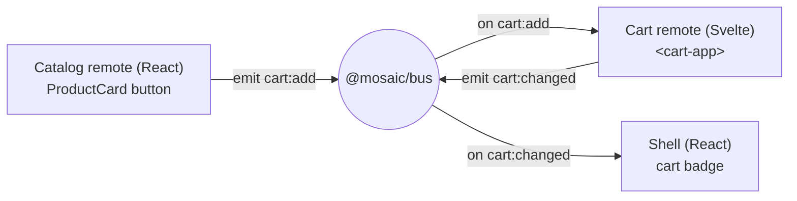

## สิ่งที่จะสร้าง

ผลตอบแทนของ event bus: flow "add to cart" จริงที่ข้าม micro-frontend สามตัวซึ่ง deploy อิสระใน setup สามแบบ โดย **ไม่มี remote ไหน import อีกตัว**



[React catalog](/mosaic/th/catalog/the-catalog-remote/) emit `cart:add` เมื่อคุณคลิก "Add to cart" [Svelte cart](/mosaic/th/cart/mount-via-web-component/) ได้ยิน event นั้น อัปเดต state ของตัวเอง แล้ว emit `cart:changed` shell ได้ยิน `cart:changed` แล้วอัปเดต badge ใน top-nav สาม hop, bus เดียว, ไม่มี import ข้าม remote เลย

## ทำไม

นี่คือช่วงที่ architecture คุ้มกับความซับซ้อนที่จ่ายไป SPA เดี่ยว ๆ แค่เรียก hook `useCart()` หรืออ่าน shared store — framework เดียว module graph เดียว ง่ายมาก Mosaic ทำแบบนั้นไม่ได้: emitter เป็น React, receiver เป็น Svelte และทั้งคู่ ship แยกกัน สิ่งเดียวที่ทั้งสามใช้ร่วมคือ [`@mosaic/bus`](/mosaic/th/communication/the-event-bus/) และ bus ก็ไม่รู้จักตัวไหนเลย

สังเกตรูปทรงของ data flow catalog **ไม่ได้** อัปเดต cart ตรง ๆ และ **ไม่ได้** อัปเดต badge — แค่ประกาศข้อเท็จจริง ("product นี้ถูกเพิ่ม") แล้วหยุด cart เป็นเจ้าของ cart state จึงเป็นตัวที่คำนวณ total ใหม่แล้วประกาศ state ใหม่ (`cart:changed`) shell เป็นเจ้าของ badge จึงเป็นตัวที่ฟัง `cart:changed` MFE แต่ละตัวเป็นเจ้าของ state slice ของตัวเองและแค่ *broadcast* การเปลี่ยนแปลง วินัยนั้น — เป็นเจ้าของ state ของตัวเอง, emit ข้อเท็จจริง, react ต่อข้อเท็จจริงของคนอื่น — คือสิ่งที่ทำให้รอยต่อ decoupled อยู่ได้เมื่อแอปโตขึ้น

## ข้อดีข้อเสีย

**Bus events vs. a shared cart store imported by every remote**

- **Pros:** ไม่มี remote ไหนพึ่งโค้ดของอีกตัว ดังนั้นแต่ละตัวยัง deploy เดี่ยวได้ cart เก็บ state ยังไงก็ได้ตามใจ (Svelte rune ในที่นี้) โดยไม่ต้องเปิดเผยทางเลือกนั้นให้ catalog หรือ shell เพิ่ม listener ตัวที่สี่ (analytics, toast) ไม่แตะอะไรที่มีอยู่แล้วเลย
- **Cons:** flow เป็นทางอ้อม — จะไล่ "click → badge" ต้องอ่านสามไฟล์ที่เชื่อมกันด้วยชื่อ event เท่านั้น ไม่ใช่ด้วย call site ไม่มีที่เดียวที่อธิบายทั้ง cart ได้ครบ state อยู่ใน cart remote และถูก mirror ไม่ใช่ share

**One-way facts (`cart:add` then a separate `cart:changed`) vs. a request that returns a result**

- **Pros:** emitter ไม่ block หรือรอ และ receiver อิสระที่จะ ignore, batch หรือ debounce cart ยังเป็นเจ้าของความจริงของ cart แต่เพียงผู้เดียว คนอื่นแค่ react ต่อสิ่งที่ cart ประกาศ
- **Cons:** catalog ไม่ได้ยืนยันตรง ๆ ว่าการ add สำเร็จ — ถ้าอยากได้ feedback (เช่นตัวเลข "1 in cart") catalog ต้อง *ฟัง* `cart:changed` ด้วย สอง event จำลองหนึ่ง interaction ซึ่งคุณต้องจำไว้ในหัว

## ติดตั้ง

### 1. `apps/catalog/src/ProductCard.tsx`

React catalog emit `cart:add` โดย import แค่ bus — ไม่เคย import cart

```tsx
import { bus } from '@mosaic/bus';

type Product = { id: string; name: string; priceCents: number };

export function ProductCard({ product }: { product: Product }) {
  return (
    <article className="product-card">
      <h3>{product.name}</h3>
      <m-price cents={product.priceCents}></m-price>
      <button
        onClick={() =>
          bus.emit('cart:add', {
            productId: product.id,
            name: product.name,
            priceCents: product.priceCents,
          })
        }
      >
        Add to cart
      </button>
    </article>
  );
}
```

### 2. `apps/cart/src/CartApp.svelte`

Svelte cart เป็นเจ้าของ cart state จึงฟัง `cart:add` อัปเดต list ของตัวเอง แล้ว emit `cart:changed` พร้อม total ใหม่ Svelte 5 rune (`$state`) ให้ reactivity แบบลึก การ push เข้า array จึงอัปเดต UI `onMount` return unsubscribe ของ bus ไว้ cleanup

```svelte
<script lang="ts">
  import { bus } from '@mosaic/bus';
  import { onMount } from 'svelte';

  type Line = { productId: string; name: string; priceCents: number; qty: number };

  let lines = $state<Line[]>([]);

  const count = $derived(lines.reduce((n, l) => n + l.qty, 0));
  const totalCents = $derived(lines.reduce((n, l) => n + l.priceCents * l.qty, 0));

  onMount(() =>
    bus.on('cart:add', (p) => {
      const existing = lines.find((l) => l.productId === p.productId);
      if (existing) existing.qty += 1;
      else lines.push({ ...p, qty: 1 });

      // Announce the new cart state. The shell (and anyone else) reacts to this.
      bus.emit('cart:changed', { count, totalCents });
    }),
  );
</script>

<ul class="cart">
  {#each lines as line (line.productId)}
    <li>{line.name} × {line.qty}</li>
  {/each}
</ul>
<p>{count} items · <m-price cents={totalCents}></m-price></p>
```

### 3. `apps/shell/src/CartBadge.tsx`

shell เป็นเจ้าของ badge ใน top-nav จึงฟัง `cart:changed` แล้ว render count `useEffect` return unsubscribe ของ `bus.on(...)` ตรง ๆ เป็น cleanup

```tsx
import { useEffect, useState } from 'react';
import { bus } from '@mosaic/bus';

export function CartBadge() {
  const [count, setCount] = useState(0);

  useEffect(() => bus.on('cart:changed', (p) => setCount(p.count)), []);

  return (
    <span className="cart-badge" aria-label={`${count} items in cart`}>
      {count}
    </span>
  );
}
```

สามไฟล์ สาม framework และ import ร่วมตัวเดียวในทุกไฟล์คือ `@mosaic/bus`

## ตรวจสอบผล

รัน shell และ remote ทั้งสองพร้อมกัน (แต่ละตัว share bus singleton จาก [บทที่แล้ว](/mosaic/th/communication/the-event-bus/)):

```bash
pnpm --filter shell dev
pnpm --filter catalog dev
pnpm --filter cart dev
```

เปิด shell ที่ `http://localhost:5000` แล้ว:

1. สังเกตว่า cart badge อ่านค่า **0**
2. คลิก **Add to cart** บน product ตัวหนึ่งใน catalog
3. list ของ Svelte cart ได้ item เพิ่ม และ badge ของ shell ขยับเป็น **1**
4. คลิก product เดิมอีกครั้ง — บรรทัดแสดง **× 2** และ badge อ่าน **2**

เพื่อพิสูจน์การ decouple เปิด DevTools **Network** throttle แล้วยืนยันว่าไม่มี request หรือ import วิ่ง *ระหว่าง* remote — traffic ข้าม MFE มีแค่การโหลด `remoteEntry.js` ของแต่ละตัวเท่านั้น path จาก click ไป badge เป็น in-page event ล้วน ๆ

จากนั้นยืนยันว่า workspace build ผ่าน:

```bash
pnpm -r build
```

คาดหวัง: ทุกแอป build ผ่าน; ไม่มี build ของ remote ไหนอ้างอิง source ของ remote อื่น

**Check your understanding:**

1. ทำไม cart — ไม่ใช่ catalog — เป็นตัว emit `cart:changed`? หลักการอะไรตัดสินว่าใคร emit event ไหน?
2. การ click ที่ catalog ไม่เคยแตะ badge เลย แต่ badge อัปเดต ไล่ตามสอง hop และบอกชื่อ event บนแต่ละ hop
3. ถ้าคุณอยากให้ปุ่มของ catalog แสดง "1 in cart" หลัง add ปุ่มนั้นต้อง subscribe event ไหน และทำไมอ่าน state ของ cart ตรง ๆ ไม่ได้?
4. อะไรในการต่อสายนี้ที่ยังให้ทีม cart เปลี่ยนวิธีที่ cart เก็บ line ของตัวเองได้ โดยไม่ทำ catalog หรือ shell พัง?

## สรุป

คุณต่อ "add to cart" ข้าม framework แบบเต็ม: React catalog emit `cart:add`, Svelte cart อัปเดตแล้ว emit `cart:changed`, และ badge ของ shell react — โดยไม่มี remote ไหน import อีกตัว มีแค่ `@mosaic/bus` คั่นกลาง MFE แต่ละตัวเป็นเจ้าของ state ของตัวเองและ broadcast ข้อเท็จจริง ต่อไปเอาการ decouple แบบเดียวกันไปใช้กับ identity: [Shared Auth & State →](/mosaic/th/auth-state/) ให้ทุก remote มี session เดียวโดยไม่ผูกกันแน่น
