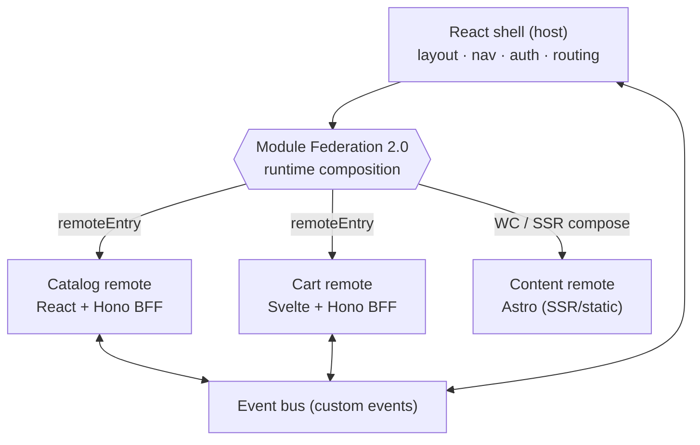

## หน้าตาของระบบ

Mosaic คือ **shell เดียวที่ compose remote หลายตัวที่ deploy แยกกันอิสระตอน runtime**

**shell** เป็น React app ที่เป็นเจ้าของทุกอย่างที่แชร์ร่วมกัน: layout, top-nav, session และ route ระดับบน shell **ไม่** import remote ตอน build time — แต่โหลดตอน **runtime** จาก URL ของ `remoteEntry` แต่ละตัว ทีม catalog จึง deploy catalog ตัวใหม่ได้ แล้ว shell จะหยิบมาใช้ในการโหลดครั้งถัดไป โดยไม่ต้อง rebuild ทั้ง shell และ remote ตัวอื่น คุณสมบัติเดียวนั้น — **independent deployment** — คือเหตุผลที่ทุกอย่างที่เหลือในสถาปัตยกรรมนี้มีอยู่ — เพื่อทำให้ deploy แบบนั้นปลอดภัย

## ทำไมต้องเป็นรูปแบบนี้

single-page app แบบดั้งเดิมคือ build เดียว deploy เดียว release train ของทีมเดียว micro-frontend แยกสิ่งนั้นออกจากกันแบบเดียวกับที่ microservices แยก monolithic backend ออกจากกัน:

- **Independent deploys** remote แต่ละตัว build และส่งงานตามตารางของตัวเอง การส่ง cart ไม่ทำให้ต้อง rebuild catalog
- **Independent tech** catalog เป็น React, cart เป็น Svelte, content เป็น Astro — แต่ละทีมเลือกตัวที่เข้ากับงาน และ shell ไม่สนใจ
- **Vertical ownership** remote แต่ละตัวเป็นเจ้าของ **UI และ data ของตัวเอง** (Hono BFF บาง ๆ) slice จึงเป็น feature เต็ม ๆ ที่ทีมเดียวเป็นเจ้าของได้ตั้งแต่ต้นจนจบ

ต้นทุนนั้นมีจริงและควรพูดให้ชัดตั้งแต่ต้น: การ compose app อิสระตอน runtime นำมาซึ่งปัญหาที่ SPA เดียวไม่เคยมี — shared dependency ต้องถูก dedupe, remote อาจโหลดล้มเหลว, style และ routing ต้องประสานกันข้ามทีม และการสื่อสารต้อง decoupled อยู่เสมอ module ส่วนใหญ่ของ Mosaic มีอยู่เพื่อแก้ปัญหาพวกนี้เป๊ะ ๆ

## องค์ประกอบ

- **Shell (host)** — React + Vite + **Module Federation 2.0** โหลด remote ตอน runtime เป็นเจ้าของ layout/nav/auth/routing
- **Catalog remote** — React + **Hono** BFF บาง ๆ ถูก expose เป็น federated module
- **Cart remote** — Svelte + Hono BFF ที่ mount เข้า React shell ผ่านตัวห่อแบบ **Web Component**
- **Content remote** — **Astro** (SSR/static) Astro ไม่ runtime-federate แบบ SPA เราจึงผนวกเข้ามาผ่านเส้นทาง Web-Component / SSR-composition — เป็นบทเรียนที่ตั้งใจให้เห็นข้อจำกัดของ Module Federation
- **Web Components** — boundary กลางสำหรับ mount และ **design system** ที่แชร์ร่วมกันซึ่งทุก framework ใช้
- **Event bus** — custom event แบบ decoupled ให้ remote ตอบสนอง "add to cart" ได้โดยไม่ต้อง import กันและกัน

## ตรวจสอบผล

คุณพร้อมไปต่อเมื่อคุณตอบคำถามพวกนี้ด้วยคำพูดของตัวเองได้:

- ไล่ดูว่าเกิดอะไรขึ้นเมื่อทีม catalog deploy เวอร์ชันใหม่ อะไร rebuild และอะไรไม่ — และการเลือกเชิงสถาปัตยกรรมข้อไหนที่ทำให้เป็นแบบนั้น?
- ทำไม shell ถึงโหลด remote ตอน *runtime* จาก `remoteEntry` แทนที่จะ import ตอน build time?
- Astro เป็น Module Federation remote แบบที่ React และ Svelte เป็นไม่ได้ ทำไม — และ Mosaic ยังผนวก Astro เข้ามาได้อย่างไร?
- บอกปัญหาสองข้อที่ runtime composition นำมา แต่ SPA เดียวไม่เคยมี

ต่อไป [prerequisites](/mosaic/th/introduction/prerequisites/) จะทำให้เครื่องของคุณพร้อม
