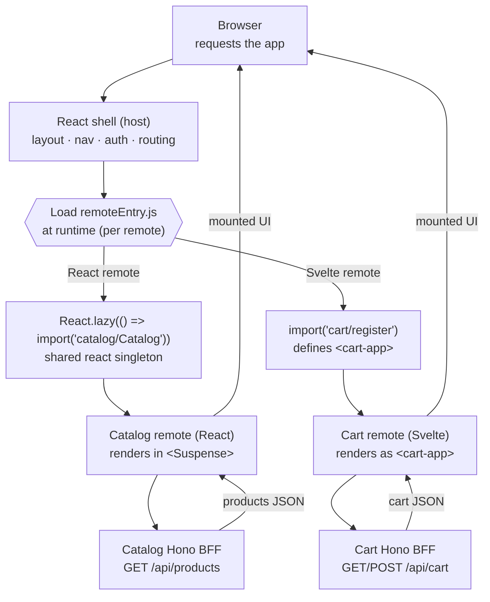

คุณเริ่มจาก monorepo เปล่า ๆ แล้วจบด้วย storefront ที่หลายทีมเป็นเจ้าของแยกกันได้ แต่ละทีมอยู่ใน framework ของตัวเอง แต่ละทีม deploy เองได้ หน้านี้ดึงทั้งระบบกลับมาอยู่ในภาพเดียว — คุณสร้างอะไร, request ไหลผ่านมันจริง ๆ ยังไง, และคุณเถียงแทนการตัดสินใจแต่ละอย่างได้แล้ว

## What you built

Mosaic คือ **React shell ที่ประกอบ React และ Svelte remote ตอน runtime ผ่าน Module Federation 2.0** โดยมี Astro content เข้ามาผ่านทาง Web Component และมี Hono BFF บาง ๆ อยู่หลัง slice ทุกอัน คุณสร้างมันเป็นชั้น ๆ:

- **monorepo และ BFF stack** — pnpm workspaces, Vite, `@module-federation/vite`, และ pattern Hono ตัวเล็ก ๆ ที่ remote ทุกตัวใช้ซ้ำ ดูที่ [Setup & Tooling →](/mosaic/th/setup/)
- **shell (host)** — React app ที่ถือ layout, top-nav, routing, และ config ฝั่ง Module Federation host ดูที่ [The Shell (Host) →](/mosaic/th/shell/)
- **Module Federation core** — การ expose และ consume remote ตอน runtime จาก `remoteEntry.js` และการแชร์ React แบบ singleton ดูที่ [Module Federation Core →](/mosaic/th/federation/)
- **catalog remote** — React remote แบบ federated ตัวแรกของคุณกับ Hono BFF ของมัน เป็น vertical slice เต็มตัว ดูที่ [Catalog Remote (React) →](/mosaic/th/catalog/)
- **Web Components interop** — ห่อ remote ให้เป็น custom element เพื่อให้ host mount มันแบบไม่ผูกกับ framework พร้อม primitive ตัวแรกของ design system ดูที่ [Web Components Interop →](/mosaic/th/web-components/)
- **cart remote (Svelte)** — Svelte 5 remote กับ BFF ของมัน mount ใน React shell ในรูป custom element `<cart-app>` ดูที่ [Cart Remote (Svelte) →](/mosaic/th/cart/)
- **content remote (Astro)** — หน้า marketing แบบ SSR/static ที่เข้ามาผ่านทาง WC/SSR แทนที่จะเป็น Module Federation ดูที่ [Content Remote (Astro) →](/mosaic/th/content/)
- **Cross-MFE communication** — event bus ที่มี type ให้ catalog บอกว่า "add to cart" ได้โดยไม่ต้อง import cart ดูที่ [Cross-MFE Communication →](/mosaic/th/communication/)
- **Shared auth & state** — session singleton ที่ทุก MFE เห็นเพียงชุดเดียว ดูที่ [Shared Auth & State →](/mosaic/th/auth-state/)
- **shared design system** — token และ Web Component primitive ที่ React, Svelte, และ Astro consume เหมือนกันหมด ดูที่ [Shared Design System →](/mosaic/th/design-system/)
- **Routing across MFEs** — shell ถือ route ระดับบน remote ถือ sub-route ของตัวเอง และ deep link วิ่งไปตกที่ remote ที่ถูกต้อง ดูที่ [Routing Across MFEs →](/mosaic/th/routing/)
- **Resilience & performance** — fallback ตอน remote โหลดไม่ขึ้น, lazy loading, และการ dedupe shared dependency ดูที่ [Resilience & Performance →](/mosaic/th/resilience/)
- **Independent deployment** — ปล่อย UI และ BFF ของ slice เดียวโดยไม่ต้อง rebuild shell หรือ remote ตัวอื่น ดูที่ [Independent Deployment →](/mosaic/th/deployment/)

## The path of a runtime remote

ไม่มีอะไรใน Mosaic ที่เกิดตอน build time แล้ว SPA เดี่ยว ๆ ทำไม่ได้ จุดสำคัญทั้งหมดอยู่ที่ **runtime** — ตอนที่ browser โหลด shell แล้ว shell ยื่นมือไปคว้า remote ที่มันไม่เคย import ต่อไปนี้คือ round trip เต็ม ๆ ตั้งแต่ page load ไปจนถึง pixel แล้ววนกลับ:

อ่านมันเป็นประโยคเดียว: browser โหลด **shell**, shell ดึง **`remoteEntry.js`** ของ remote แต่ละตัวตอน runtime, remote **React** mount ผ่าน `React.lazy` โดยแชร์ React ของ host ขณะที่ remote **Svelte** mount เป็น custom element **`<cart-app>`** โดยไม่แชร์อะไรที่เป็น React เลย, remote แต่ละตัวคุยกับ **Hono BFF ของตัวเอง** แล้ว UI ที่ render เสร็จก็กลับไปตกลงในหน้า สอง framework, สอง deploy train, ประสบการณ์เดียวที่ประกอบขึ้นมา — และ shell ไม่ได้ import ทั้งคู่เลยตอน build time

## The decisions you can now defend

ทุกข้อในนี้คือทางแยกที่มีทางเลือกอื่นจริง ๆ ตอนนี้คุณบอกได้แล้วว่าทำไม Mosaic ถึงเลือกทางที่มันเลือก — และมันแลกมาด้วยอะไร

| Decision | Why | Trade-off | Lesson |
|---|---|---|---|
| ประกอบแบบ Module Federation **runtime** ไม่ใช่ bundle ตอน build time | remote แต่ละตัว deploy เองได้ shell หยิบ `remoteEntry.js` ตัวใหม่มาใช้ในโหลดถัดไปโดยไม่ต้อง rebuild | การโหลดตอน runtime เพิ่ม network hop, ต้อง dedupe dependency, และพังได้ — ปัญหาที่ bundle เดี่ยวไม่มีวันเจอ | [Module Federation Core →](/mosaic/th/federation/expose-and-consume/) |
| หลาย framework ผ่าน **Web Components** | ขอบเขต custom element ให้ remote Svelte (หรือ Astro) mount อยู่ใน React shell ที่ไม่แชร์โค้ด framework กับมันเลย | คุณเสีย props/context แบบ React-native ข้ามขอบเขตไป แล้วต้องส่งข้อมูลเป็น attribute/event แทน | [Web Components Interop →](/mosaic/th/web-components/custom-element-boundary/) |
| **Hono BFF ต่อ remote** (vertical slice) | แต่ละทีมเป็นเจ้าของทั้ง UI *และ* data ของตัวเองแบบครบวงจร slice หนึ่งจึงเป็น feature เต็มตัวที่ไม่ผูกกับ backend ร่วม | มี service ให้รันและ deploy มากขึ้น เรื่องที่ควรทำร่วมกันอาจเพี้ยนกันข้าม BFF ถ้าคุณไม่ตั้งใจดูแล | [Catalog BFF →](/mosaic/th/catalog/catalog-bff/) |
| **event bus** ไม่ใช่ import ร่วม | remote ตอบสนอง "add to cart" ได้โดยไม่ต้อง import กันเอง ทำให้ deploy แยกกันได้ | event เป็น contract ที่ไม่มี type บนสาย event ที่ถูกเปลี่ยนชื่อจะพังเงียบ ๆ ถ้าคุณไม่ทำ version ให้มัน | [The Event Bus →](/mosaic/th/communication/the-event-bus/) |
| **Independent deployment** ของแต่ละ slice | ปล่อยทีมเดียวโดยไม่ต้อง redeploy ทีมอื่น — ผลตอบแทนที่ทั้งสถาปัตยกรรมนี้ตั้งขึ้นมาเพื่อรักษาไว้ | คุณต้องทำ version ให้ remote และทำให้ shell ทนได้ตอน remote หายไปชั่วครู่ | [Versioning Remotes →](/mosaic/th/deployment/versioning-remotes/) |

ถ้าคุณพาใครสักคนเดินผ่านตารางนี้ได้โดยไม่ต้องดูโน้ต แปลว่าคุณเข้าใจ micro-frontend แล้ว — ไม่ใช่ในฐานะ buzzword แต่ในฐานะชุดของการแลกเปลี่ยนที่คุณเลือกมันเองอย่างตั้งใจ

## What was deliberately simplified

Mosaic เป็น build เพื่อการสอน หลายอย่างเป็นตัวแทนแบบตรงไปตรงมาของเรื่องระดับ production เพื่อให้ตัวการประกอบยังคงเป็นพระเอก:

- **Mock auth** session เป็น localStorage singleton ไม่ใช่ authentication จริง — พอที่จะพิสูจน์ว่า session เดียวไหลผ่านทุก MFE ได้ ไม่มากกว่านั้น ดูที่ [Shared Auth & State →](/mosaic/th/auth-state/session-singleton/)
- **BFF แบบ in-memory** Hono BFF แต่ละตัว serve JSON คงที่จาก memory ไม่มี database ไม่มี persistence ข้าม restart *รูปทรง* ของ BFF เป็นของจริง แต่ storage ไม่ใช่ ดูที่ [Catalog BFF →](/mosaic/th/catalog/catalog-bff/)
- **Astro เข้ามาผ่าน Web Components ไม่ใช่ Module Federation** Astro ไม่ federate ตอน runtime แบบ SPA content remote จึงเข้ามาผ่านทาง WC/SSR — เป็นบทเรียนตั้งใจว่าไม่ใช่ทุกอย่างจะเข้ากับ Module Federation ดูที่ [Composing SSR →](/mosaic/th/content/composing-ssr/)
- **ไม่มี SSR streaming** shell ประกอบ remote ที่ฝั่ง client ไม่มีการ stream HTML ของ remote จาก server เข้าไปใน response แรก นั่นคือสิ่งแรกที่คุณจะเพิ่มเข้าไปเวลาทำจริง และ [next steps](/mosaic/th/wrap-up/next-steps/) ก็เริ่มตรงนั้น

ไม่มีข้อไหนเปลี่ยนสถาปัตยกรรม — พวกมันคือส่วนที่คุณจะเสริมให้แข็งแรงหลังจากพิสูจน์รูปทรงแล้ว

## Recap

คุณสร้าง storefront ที่ประกอบตอน runtime และหลาย framework และที่สำคัญกว่านั้น ตอนนี้คุณเถียงแทนทุกรอยต่อในมันได้แล้ว: ทำไม shell ถึงโหลด remote ตอน runtime, ทำไม Web Components ถึงเป็นขอบเขตข้าม framework, ทำไมแต่ละ slice ถึงเป็นเจ้าของ BFF ของตัวเอง, ทำไม remote ถึงคุยกันผ่าน bus แทนที่จะ import กันเอง, และทำไม independent deployment ถึงเป็นจุดหมายทั้งหมด

ต่อไป พา Mosaic ให้ไปไกลกว่า build เพื่อการสอน: [Next Steps →](/mosaic/th/wrap-up/next-steps/)
